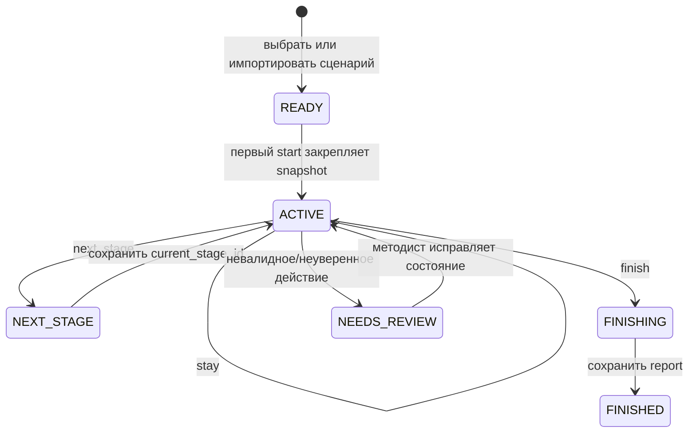

# Training scenarios: план ветки `training-scenarios`

## Граница этой итерации

Цель — дать методисту пять коротких, воспроизводимых корпоративных тренировок и заложить в backend явное состояние сценария. Первым остаётся быстрый путь речи: сценарная логика не должна добавлять отдельный LLM-вызов перед первой PCM-порцией.

В этой итерации не реализуются голосовой ввод, RAG, сложный barge-in, повторная генерация, полноценная разметка слов по аудиотаймкодам и production-авторизация.

## Роли и контракт

- Методист выбирает готовый сценарий или импортирует ограниченный `.md`-файл, проверяет этапы и критерии.
- Сотрудник проходит один диалог с аватаром; сценарий закрепляется за session при первом `start`.
- Агент задаёт следующий вопрос, остаётся на этапе, переводит к следующему либо завершает тренировку.
- После finish методист получает transcript, сохранённый scenario snapshot и report по критериям сценария.

Источником истины является PostgreSQL session. Frontend хранит только выбранный до старта сценарий и текущий `generationId` для отбрасывания устаревших browser frames.

## Пять демонстрационных сценариев

| ID | Назначение | Этапы | Детерминированный критерий успеха |
|---|---|---|---|
| `sales-discovery` | B2B discovery-звонок | контакт → выявление потребности → ценность → следующий шаг | сотрудник задал минимум два открытых вопроса и согласовал следующий шаг |
| `sales-objection` | Работа с возражением «дорого» | выслушать → уточнить причину → связать цену с ценностью → договориться о действии | сотрудник не спорит с возражением и формулирует проверочный вопрос |
| `structured-interview` | Собеседование кандидата | мотивация → опыт STAR → кейс → вопросы кандидата → закрытие | сотрудник получает одинаковый набор тем, а агент не выходит из роли интервьюера |
| `policy-knowledge` | Проверка знания корпоративной политики | вводный кейс → правило → пограничный случай → итог | финальная оценка отделяет правильное правило от угадывания по пояснению |
| `manager-feedback` | Сложный разговор менеджера с сотрудником | факт → влияние → выслушать → договорённость → фиксация следующего шага | сотрудник использует наблюдаемый факт и конкретную договорённость |

Каждый сценарий ограничивается 3–5 этапами и 5–7 короткими репликами, чтобы финальная проверка была быстрой и повторяемой. Для каждого будут добавлены fixture transcript: happy path, ответ не по теме и преждевременное завершение.

## Формат сценария `.md`

Импорт не передаёт произвольный текст напрямую в system prompt. В начале Markdown размещается строго валидируемый JSON front matter, далее — человекочитаемая инструкция методиста.

```markdown
<!-- scenario-meta
{
  "id": "sales-discovery",
  "version": 1,
  "title": "Выявление потребности",
  "criteria": ["Выявление потребности", "Ценность", "Следующий шаг"],
  "stages": [
    {"id": "need", "goal": "Уточнить контекст", "exitRule": "need_confirmed"},
    {"id": "next_step", "goal": "Согласовать действие", "exitRule": "next_step_agreed"}
  ]
}
-->

Аватар играет роль клиента. Задавай по одному короткому вопросу и не раскрывай критерии оценки.
```

Backend ограничивает размер файла, количество этапов и критериев, длину каждого поля и допустимые идентификаторы. После валидации хранится неизменяемый `scenarioSnapshot`; raw Markdown не логируется. Готовые сценарии лежат в `src/main/resources/scenarios/*.md` и проходят ту же валидацию, что и пользовательский импорт.

## Целевая state machine



`ScenarioAction` имеет только `STAY`, `NEXT_STAGE`, `FINISH`, `NEEDS_REVIEW`. Backend валидирует действие относительно `current_stage_id`; LLM не может перейти через этап или завершить session без допустимого перехода.

## План внедрения

### 1. Domain и persistence

1. Добавить `ScenarioDefinition`, `ScenarioStage`, `ScenarioAction`, `ScenarioSessionState` и русский KDoc.
2. Добавить V3 Flyway migration: `scenario_snapshot JSONB`, `scenario_version`, `current_stage_id`, `generation_id`, `scenario_action` в `chat_sessions`; индекс по `scenario_id`.
3. Расширить `ChatRepository` атомарными методами: создать session со snapshot, прочитать/обновить stage только при ожидаемой версии состояния, пометить finish.
4. Сохранять snapshot вместе с session, чтобы обновление `.md` не меняло уже начатую тренировку и report оставался воспроизводимым.

### 2. Каталог и импорт сценариев

1. `ScenarioCatalog` загружает пять resource-файлов один раз при старте и валидирует их fail-fast.
2. `ScenarioParser` разбирает только ограниченный JSON front matter; не добавлять YAML dependency для MVP.
3. `ScenarioValidationService` возвращает machine-readable ошибки методисту: duplicate stage, неизвестный exit rule, пустой criterion, слишком длинный prompt.
4. API: `GET /api/scenarios`, `POST /api/scenarios/validate`. Импорт сначала только preview в browser; сохранение пользовательских шаблонов намеренно отложить.

### 3. Запуск и сценарный ход

1. Расширить первое `WS start` полем `scenarioId`; backend создаёт session только после проверки сценария.
2. В `ConversationContextBuilder` передавать system prompt как композицию: базовая безопасность → persona сценария → текущий stage → transcript window. Не включать полный Markdown или пользовательский текст без валидации.
3. Ввести `ScenarioConversationService` поверх текущего `ConversationService`: он загружает state, строит context и после ответа применяет валидированное action.
4. На PoC action извлекается из финальной structured части Gemini stream или function call. Текст ответа продолжает stream сразу; переход stage фиксируется только после итогового action. Отдельный предварительный classifier/LLM-вызов запрещён на fast path, потому что он ухудшит first audio latency.
5. Если action отсутствует, невалиден или модель не уверена — `NEEDS_REVIEW`; session не перескакивает этап. Для демонстрации методист видит безопасное «сценарий требует проверки», а не скрытую ошибку.

### 4. Синхронность речи и субтитров — главный приоритет

1. Для каждого ответа backend создаёт `generationId` и передаёт его во всех `session`, `delta`, `subtitle_chunk`, PCM и `done` frames.
2. Browser принимает frame только при совпадении с активным `generationId`; это минимальный фундамент для будущего barge-in, без реализации сложной политики отмены сейчас.
3. TTS chunk получает собственный `chunkId`. Backend посылает `subtitle_chunk(chunkId, text)` непосредственно перед первым PCM соответствующего chunk; browser показывает субтитр по факту поступления аудио, а не при Gemini delta.
4. Simli получает ровно тот же PCM16, который является источником движения губ. Не добавлять независимый таймер мимики.
5. Оставить latency budget: `input → simli_speaking <= 3 с`, `browser_first_pcm → simli_speaking <= 200 мс` как proxy, `input → gemini_first_delta`, `input → tts_first_audio` и `input → browser_first_pcm` для поиска регрессии.
6. Не вводить очередь между text chunk и PCM сверх существующего bounded backpressure. Сценарное действие вычисляется после начала речи, а не до неё.

### 5. Finish и report

1. `EvaluationService` использует criteria из snapshot вместо фиксированного списка, но сохраняет старый API DTO для совместимости до отдельной миграции frontend.
2. Report содержит `scenarioId`, `scenarioVersion`, достигнутые этапы, action history и criteria result.
3. Ошибка evaluation оставляет session `ACTIVE`, как и текущий контракт; повторный finish идемпотентен.

### 6. Проверки и измерения

1. Unit: parser/validator `.md`, допустимые переходы state machine, optimistic update state, prompt composition без prompt injection.
2. Integration: выбрать каждый из пяти preset, провести happy path, сохранить expected `current_stage_id`, finish и report.
3. Streaming: старый `generationId` не меняет subtitle/PCM state browser; `subtitle_chunk` упорядочен перед своим PCM.
4. Performance: сохранить пять измеренных trace по `turnId`; fail smoke при `simli_speaking > 3 с`, а расхождение `PCM → speaking` помечать warning выше 200 мс.
5. Outage: Gemini/ElevenLabs timeout не меняет stage и не сохраняет partial assistant; session доступна для повторного хода.

## Порядок работы

1. Закоммитить пять preset `.md` и parser/validator с тестами.
2. Добавить state в миграцию, repository и API выбора сценария.
3. Подключить scenario prompt и валидированный action к stream без добавления latency до первого PCM.
4. Добавить `generationId` и subtitle chunk protocol.
5. Обновить report, провести пять smoke-диалогов и зафиксировать measured latency.

## Риски и честные ограничения

- `speaking` Simli — proxy начала синхронной мимики; точную 200 мс lip-sync нельзя доказать без media timestamps.
- Пользовательский `.md` остаётся входом с prompt-injection риском: schema ограничивает структуру, но методистский свободный текст должен быть отделён и явно экранирован в prompt.
- В текущем продукте сценарии — versioned resources и session snapshot, а не полноценный редактор и каталог методистов.
- Полная отмена старых аудио/кадров сознательно остаётся следующим пакетом; здесь добавляется только протокольный фундамент `generationId`.
